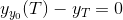

J'ai initialement compilé ces notes pour mon propre usage, afin d'acceder rapidement aux concepts en cas de besoin. Les concepts ne sont pas exhaustivement détaillés car j'ai mis l'accent sur les procédures MATLAB. J'invite ceux qui voudraient plus de détails à regarder le livre numérique 
<a href="https://github.com/madeenamadou/econ-comp/blob/master/%5BMario_J._Miranda%2C_Paul_L._Fackler%5D_Applied_Comput.pdf">Applied Computational Economics and Finance</a> de Mario J. Miranda & Paul L. Fackler.

J'ajouterai des ressources et codes MATLAB sur le meme theme avec le temps, donc n'hesitez pas à <a href="https://github.com/madeenamadou/">suivre</a> ou <a href="https://github.com/madeenamadou/econ-comp/fork">copier</a> le <a href="https://github.com/madeenamadou/econ-comp/">répertoire GitHub</a>. Le contenu de cette page a été écrit en <strong>Markdown</strong>.

Bonne lecture !!

<hr>


<h2>Tables des matieres</h2>
...


## Système d’équations linéaire : Ax = b
### Méthodes directes

Décomposition LU, Cholesky `x = A\b`

Méthode itérative (forme Qx = b + (Q − A)x)

- Gauss-jacobi : `gjacobi (A,b)`
- Gauss-seidel : `gseidel (A,b)`

## Systèmes d’équations non linéaires : Points fixes (f(x) = x) & Solutions racines (f(x) = 0)
### Méthode bisection, sur un interval [a,b]

Pour une fonction f,
```Matlab
bisect ('f',a,b)
```

### Méthode Newton : un ou plusieurs variables, avec des valeurs initiales, utilise le jacobien

Pour une fonction f à 2 variables, avec des valeurs initiales respectives x1 et x2 
```Matlab
newton('f',[x1;x2])
```

### Méthode Quasi-Newton : utilise une approximation du jacobien
- Secant Method : une variable
	
	Broyden Method : plusieurs variables, utilise une valeur initiale pour la racine, et une autre pour le Jacobien
 	Pour une fonction f à deux variables, et pour les valeurs initiales x1et x2 des variables `broyden('f',[x1;x2])`
	
	>**Note :** Pour ces méthodes, on peut ajouter une backstepping routine, pour éviter les divergences

### Méthodes exclusives pour Point-fixes
Méthode Itération de fonction, pour une valeur initiale x0
Pour une fonction g, 
```Matlab
fixpoint('g',x0)
```

### Complementary Method : utilise le jacobien
Pour résoudre f(x) = 0, pour *8a < x < b* ;  a et b peuvent être Inf

- Méthode semismooth
	
	Pour une fonction f, un intervalle [a,b], et une valeur initiale x0, 
	```Matlab
	ncpsolve('f',a,b,x)
	```
 
- Méthode minmax
	
	Spécifier d’abord l'option 'type'
	```Matlab
	optset('ncpsolve','type','minmax')
	```

## Problèmes d’optimisation (recherche du maximum et du minimum)
### Méthodes sans dérivées :
- Method Golden Search : une variable, optimum local sur un interval [a,b]
	
	Pour une fonction f, sur un interval [a,b]
	```Matlab
	golden('f',a,b)
	```

- Méthode Algorithm Nelder-Mead : plusieurs variables, avec des valeurs initiales pour les variables
	
	Pour une fonction f à deux variables, avec les valeurs initiales x1 et x2,
	```Matlab
	neldmead('f',[x1;x2])
	```

## Méthode d’intégration et de différentiation
### Méthode d’intégration

- Calcul de l'aire

	**Méthodes Newton-cotes** : calcul de l’aire sous la fonction
	
	Trapezoid rule : pour les fonctions discontinues ayant des points d’inflexion
	
	Pour n trapezes, sur un intervalle [a,b], *n* les nodes et *w* les weights,
	```Matlab
	[x,w] = qnwtrap(n,a,b)
	```
	
	Simpson rule : pour les fonctions plus lisses
	```Matlab
	[x,w] = qnwsimp(n,a,b)
	```
	
	>Si *w(x)=1*, on calcule l’aire sous la fonction
	
	**Méthodes Gaussian quadrature**
	
	Legendre quadrature, pour w(x) = 1
	```Matlab
	[x,w] = qnwlege(n,a,b)
	```

- Calcul de l’espérance

	**Méthodes Gaussian quadrature**
	
	Pour x suivant une **loi normale (mu, var)**, *n* les nodes gaussiens et *w* les weights gaussiens,
	```Matlab
	[x,w] = qnwnorm(n,mu, var)
	```
	>Si w(x) = *fonction de densité de probabilité* de *x*, on calcule l’espérance de la fonction par `Somme(w*f(x))`

	**Méthodes Intégration Monte-Carlo**
	
	Il faut générer pseudoaléatoirement *n* nodes *x* d’après la distribution ; les weights *w=1/n* étant identiques
	
	L’espérance de *f* est obtenue par
	```Matlab
	Somme(w*f(x))
	```

	**Méthodes Quasi-Monte Carlo**
	
	Ici les *n* nodes *x* sont déterministes, sur une intervalle [a,b] ;  les weights *w=(b-a)/n* étant identiques
	
	L’espérance de *f* est obtenue par
	```Matlab
	Somme(w*f(x))
	```
 
### Méthode de différentiation

Pour une fonction *f*, une approximation *O(h²)* de sa dérivée, autour du point *x0*, est de la forme:
>*f'(x0) = a*f(x0) + b*f(x0 + h) + c*f(x0 + alpha*h) [ + O(h²)]*

>où (x0 + h), (x0 + alpha*h) sont deux autres points,
>choisir, alpha = 2, et choisir h quelconque, les paramètres a, b et c, s’obtiennent en résolvant le système suivant :

```
a + b + c = 0
b + cλ = 1/h
b + cλ2 = 0
```

## Initial Value Problem (IVP)
Prend la forme d’une equation différentielle à résoudre pour une function solution, connaissant les valeurs initiales pour la fonction.

>e.g. à l’ordre 1  *y'(t) = f(t,y(t))*

>ou à l’ordre 2 *y''(t) = f(t,y(t),y'(t))* 

Il faut réécrire parfois le problème sous la forme d’une équation différentielle. Une équation différentielle d’ordre 2 peut se ramener à un système d’équation différentielle d’ordre 1.

Le principe de résolution est de dériver une approximation de taylor de  à l’ordre 1 (Méthode de Euler), ou 2 (Méthode Runge-Kutta 2), ou 4 (Runge-Kutta 4). On choisit un pas h pour subdiviser la période de temps ; plus petit h, mieux c’est en général.

>Méthode de Euler : *y(t+h) = y(t) + y'(t)h*

>Méthode Runge-Kutta 2 : *y(t+h) = y(t) + h[a_1k_1 + a_2k_2]*

Pour une bonne approximation, il faut que :


On choisit a_2 puis on trouve ensuite les autres paramètres. Il existe trois méthodes communes pour évaluer les paramètres inconnus, connus comme: méthode de Heun, la méthode du point milieu et la méthode de Ralston.

**Heun’s Method** : (a_2,a_1,p_1,q_1) = (1/2,1/2,1,1)

**Midpoint’s Method** : (a_2,a_1,p_1,q_1) = (1,0,1/2,1/2)

**Ralston’s Method** : (a_2,a_1,p_1,q_1) = (2/3,1/3,3/4,3/4)

**Paul L. Fackler & Mario J. Miranda** : (a_2,a_1,p_1,q_1) = (3/4,1/4,2/3,2/3)

**Méthode Runge-Kutta 4** : 

>Avec
>
>

Pour un système d’équation différentiel « system », une période allant de t0 à tf, des valeurs initiales stockées dans la matrice «inits», la résolution numérique avec Runge-Kutta 4 :

```Matlab
[t,y] = ode45('system',[t0 tf],inits)
[t,y] = rk4('system',(t0:tf)',inits)
```

>Ou, avec un pas «h», des valeurs initiales stockées dans la matrice «Y0», la période initiale «t0», pour un système d’équation différentiel «f», la résolution numérique MuPAD avec Runge-Kutta 4 :
```Matlab
sol1 := numeric::odesolve2(f, t0, Y0, RK4, Stepsize=h)
```

## Boundary Value Problem
Il s’agit d’un boundary value problem quand on ne connait pas les valeurs initiales, pour la fonction. Il est souvent donné une boundary condition, comme par exemple la valeur terminale pour la fonction y_T.

On cherche le guess y_0 pour la valeur initiale pour la fonction tel que :



On réécrit ce problème sous la forme d’un problème de recherche de solution racine, à résoudre avec **broyden**. Quand on trouve on peut résoudre l’IVP.

e.g: ici, on doit chercher la solution racine pour la fonction «shooting» avec **broyden**.

On crée d'abord une fonction de «shooting»

>Function F = shooting (y0)
>
>[t,y] = ode45('system',[t0,tf],y0);
>
>F = y(end) - y_end;

```Matlab
y0 = broyden('shooting',guess);
```

## Interpolation

Il s’agit d’obtenir une approximation  aussi correcte que possible d’une fonction f.

Pour un ensemble de _n_ interpolation nodes (x_i,f(x_i)), on veut que : 

De façon générale,  est construit à partir d’une combinaisons linéaires de plusieurs fonctions connues _ϕ_. Pour _m_ degrés d’interpolation (_m_ fonctions ϕ_j_), on a :


Les c_j sont inconnues et pour les obtenir, on résous simultanément les équations linéaires suivantes :

Pour _i = 1...n_,


Les méthodes d’interpolations diffèrent dans le choix des fonctions ϕ. Les ϕ_j sont généralement des polynômes.

On peut des polynômes Chebychev.

Pour un degré d’interpolation _m_, un intervalle de nodes , on obtient les 
```Matlab
phi = fundefn('cheb', m, a, b);
```

Ensuite, on obtient les  pour une interpolation de f

```Matlab
c = funfitf(fhat, f);
```

Puis on calcule , pour “x” le vecteur-colonne des nodes 
```Matlab
fhat = funeval(c,phi,x)
```

On peut des polynômes splines. Le cubic splines est l’interpolation à l’ordre 3 avec cette famille de polynômes. En utilisant cubic splines ,

```Matlab
phi = fundefn('spli', m, a, b, k); 
phi(nodes) = funbas(basis);
c = funfitf(fhat, f); 
//ou
c = phi(nodes) \ v ; 
fhat = funeval(c,phi,x);
```

## Méthode Collocation
Il s’agit d’une méthode pour la fonction f solution du problème du type :

 sur un intervalle . Comme un système d’équation différentielle à l’ordre zéro. Le principe est d’utiliser une interpolation  de f.

Pour un ensemble de _n_ collocation nodes  le problème revient à résoudre simultanément les équations linéaires suivantes, pour  :

Pour 


On peut obtenir les collocations nodes à partir de nodes chebychev…
```Matlab
phi = fundefn('cheb', m, a, b);
x = funnode(phi);
```

Ensuite, on peut résoudre ce problème en utilisant broyden.

Pour un système d’équation «system», 
```Matlab
c = broyden('system',guess);
```

## Programmation Dynamique

Sur _N_ periodes . L’horizon _N_ peut être fini ou infini.

On peut observer à chaque période, plusieurs états  possibles. L’espace des états _s_ peut être discret ou continu.


Pour chaque état, il y a un ensemble d’actions disponibles x. L’espace des actions peut aussi être discret ou continu.


### Discrete state space et discrete action space
* Horizons finis

À chaque période t, l’action x dans l’état s produit le reward f(x,s). S est un processus, soit deterministe, soit stochastique.

Pour S stochastique, on suppose qu’il s’agit d’un markov decision process, donc, la probabilité d’un état  dépend seulement de l’état s et de l'action x a la periode precedente t. Quand il n’y a qu’une seule action disponible pour chaque état possible, on parle de processus chaine de markov.

La probabilité de transition 

L’objectif est de trouver un ensemble optimal d’action  poru chaque 

Soit  le reward maximum que l’agent peut atteindre à partir de _t_ jusqu’à la fin de période _T_. Pour chaque état  possible à _t_, il y a une valeur 

Pour ,


C'est <strong>l’équation de Bellman</strong>.

Ensuite, on cherche  tel que :


On impose une condition terminale, généralement . Avec cette condition, pour (+1) on va backward, en cherchant  puis  et ainsi de suite jusqu’à .

* Horizons infinis

Pour les horizons infinis,  ne dépend plus de _t_ et le problème s’écrit :


Pour ,


Et ainsi de suite….

On peut utiliser la méthode backward recursion.

Soit _n_ le nombre fini d’états possibles, _m_ le nombre fini d’actions disponibles. À la période _t_, la matrice des probabilités de transition vers l’état 


Il y a _n_ possibilités pour l’état  suivant :


Pour une fonction reward «f», un horizon «N», un facteur d’escompte «delta»,  les probabilités de transition «P» dans une matrice _m x n x n_,

On crée la structure «model»
```Matlab
model.reward    = f;
model.transprob = P;
model.horizon   = N;
model.discount  = delta;
```

Ensuite on trouve la solution 
```Matlab
[v,x] = ddpsolve(model);
```

Rechercher les informations suivantes:
	* State space
	* Action space
	* Reward function (based on Action space)
	* Transition probability matrix (m x n x n)

Pour un <strong>continuous state space</strong> S, le next state est une fonction continue du current state, du current action et d’un terme d’erreur (déterministe ou stochastique) : 

On travaille avec une approximation de la objective function (avec cubic spline)

, à partir de collocation nodes 

Pour chaque collocation nodes , on veut résoudre :


Si  est stochastique, on calcule l’espérance : 


avec une méthode d’intégration (comme gaussian quadrature). À partir de nodes  et des poids , l’équation devient: 


Concrètement…

Pour une fonction de transition d’état , avec  une v.a. , 

On génère les nodes  et les poids 

```Matlab
[e,w] = qnwnorm(m,0,sigma^2);
```

Ensuite on trouve les 

```Matlab
basis = fundefn('spli', n, Smin, Smax);    
p     = funnode(basis);      
```

Puis on trouve 

```Matlab
phi   = funbas(basis); 
```

Ensuite, à partir d’un vecteur de valeurs initiales  on calcule :


```Matlab
c = zeros(n,1);
```

Et on recherche  tel que 


L’objectif est de trouver  qui vérifie :


```Matlab
for it=1:1000
    cold   = c;
    vprime = 0; 
    for k=1:m 
        vprime = vprime + w(k)*funeval(c,basis,beta*p+e(k));
    end
    v = max(exp(p)-K,delta*vprime);
    c = Phi\v;
    if norm(c-cold)<1.e-10, break, end
end

% on devrait avoir au final, 
funeval(c,basis,p) = v
```

Pour un <strong>continuous action space</strong> X

Action X, est une fonction du state S ; on a l’équation du problème : 


Action X peut être contrainte ou pas.

Sans contrainte, on trouve la solution à partir de la condition de premier ordre : 


